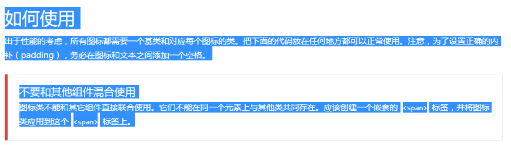
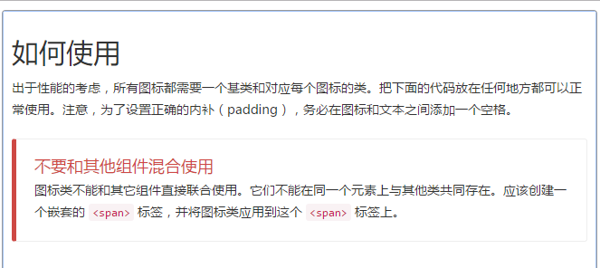
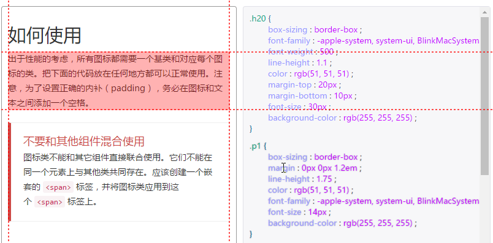

# 一个web样式获取工具——copy2style

如果你在小公司工作过，可能会经常遇到这样的工作，某个产品经理对我们说：“把这个网站的样式扒下来。”可能在产品经理的眼里，这个工作非常简单，但实际上扒页面样式是一个很痛苦的工作。如果照着人家的页面自己写一遍，工作量不下于参照ui提供的原型图重新开放；如果想办法copy人家的css文件，将其导入我们自己的网站中，可能会出现各种各样的冲突问题。

有没有简单的web页面样式获取工具

## 神奇的contenteditable属性
contenteditable属性可以使我们的div也具备文本编辑器的功能，因为他支持dom编辑，所以很多富文本编辑器都是利用contenteditable属性原理开发的。事实上contenteditable还有个神奇的功能，就是dom元素粘贴，在粘贴的同时，会将原网站的样式以行内样式的形式保留，以便大限度的保留原始dom的样式。利用这一特性，我们似乎可以找到获取页面样式的捷径。

## copy2style
copy2style是个web样式获取工具，它能够将copy下来的页面文字或者布局变为样式输出，能够最便捷的方式让我们获取目标页面的样式，同时不用担心目标页面的css会污染我们自己的页面。
[工具示例](https://laden666666.github.io/my-copy2style/ "Title")，目前完成度还很低，不过已经可以使用它获取需要的样式了。

## 使用方法

### 第一步，复制文字或布局
用浏览器打开要获取样式的页面，鼠标选择要复制的文字或布局。如果对方页面有**user-select:none**的设置用**f12的开发者工具**将其去除。
以bootcss网站为例，我们复制其中一个文本的样式

### 第二步，将内容粘贴到工具页面
打开[工具页面](https://laden666666.github.io/my-copy2style/ "Title")，将刚才复制的样式粘贴进入工具页面左边的富文本框。如下图，页面的样式基本和原网站一样。

### 第三步，选择目标元素的css样式
根据工具页面右侧的样式表，选择合适的部分，copy到你自己的页面中

# 郑重声明
>此工具仅限学习交流使用，同时希望大家不要抄袭别人的设计，抄袭者会被永远钉在耻辱柱上。
